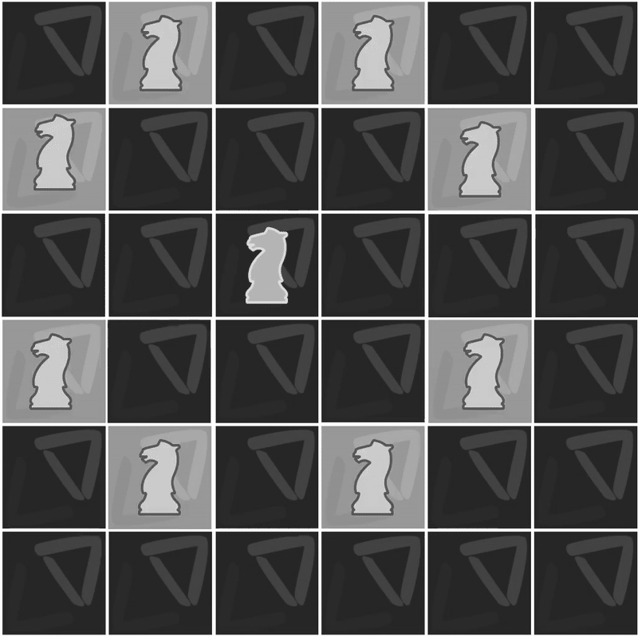

# Evolve Season 3 - Mini Project

## Problem statement:

    Given a chessboard of size 8X8, initial position of knight and desired position of knight, you need to find best possible knight’s movements in a game to reach final position. In a chess game, a knight’s basic move is two squares horizontally and one square vertically or two squares vertically and one square horizontally.

## Inputs:

    - Grid of size 8x8 - Representing a chess board
    - Initial Position of knight - int[2] which represent row and col position.
    - Final Poisiton of Knight - int[2] which represent row and col position

## Output:

    - List containing the best cordinate for the knight to move from starting to finishing position. 
    (This is an optimization problem)

## Logic

This is basically an unweighted undirected graph problem that can be solved using backtracking.

    1. At any given position, the knight can move in one of 8 direciton
        1. i-2, j-1
        2. i-2, j+1
        3. i-1, j-2
        4. i-1, j+2
        5. i+1, j-2
        6. i+1, j+2
        7. i+2, j-1
        8. i+2, j+1

    2. We need the shortest path, so we need to establish a traversal method. --> going with BFS. Reason is BFS will visit all the nearest moves first and only then reach out to its child. Cuts short of the time taken to traversal

    3. At any traversal we can make two decision: 
        - if its the destination node, we exit,
        - if its not dest. and its within bounds, then we check its children.
        - We should not visit the visited node again to avoid any cycles!

    4. In Order to find the path which is shortest, at every visit we need to find who is the node from where we came from. So introducing a point class, that stores previous node.

    5. In order to find the path we walk through the LinkedList of Points till we reach the starting node who's previous whould be null. 

    6. Since we need the reverse of this as we are storing previous node, 
        - we can either reverse the otuput array after walking through the linked list or, 
        - Swap the source and destination within login to find the path from source --> destination!

## Complexity

    Time Complexity --> O(N*N) --> in worst case we need to visit all nodes atleast once!
    Space Complexity --> O(N*N) --> we are using hashset that stores every point so we are atmost storing all nodes. 

# Chekout my android app to visualize the knights traversal @ [KNIGHT TRAVERSAL UI](https://github.com/RajakumaranC/KnightsTraversalUI)